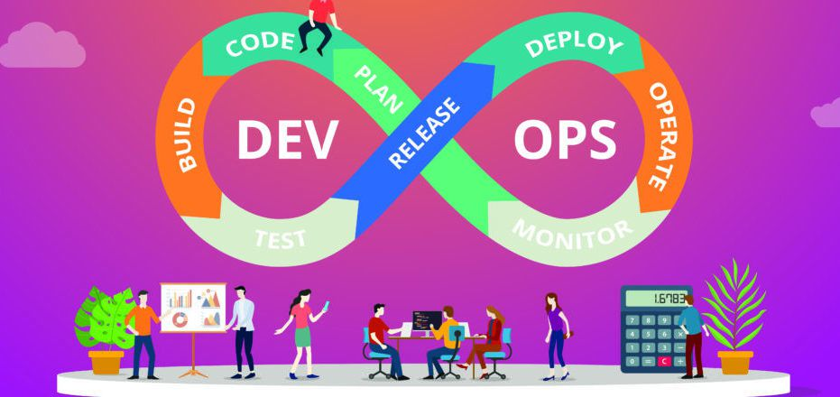

## The Next Generation
<pre>
<a href="https://coressj.github.io/Project1" target="_top">Home</a> <a href="https://coressj.github.io/Project1/page2" target="_top">Categories</a> <a href="https://coressj.github.io/Project1/page3" target="_top">About us</a> 
</pre>
 <link rel="shortcut icon" type="image/x-icon" href="favicon.ico">

*We are the Dev and Ops team that is going to blow this project out of this world*

---
What is DevOps
---

A compound of development (Dev) and operations (Ops), DevOps is the union of people, process, and technology to continually provide value to customers.

What does DevOps mean for teams? DevOps enables formerly siloed roles—development, IT operations, quality engineering, and security—to coordinate and collaborate to produce better, more reliable products. By adopting a DevOps culture along with DevOps practices and tools, teams gain the ability to better respond to customer needs, increase confidence in the applications they build, and achieve business goals faster.

There should be whitespace between paragraphs.

There should be whitespace between paragraphs. We recommend including a README, or a file with information about your project.

**The benefits of DevOps**

Teams that adopt DevOps culture, practices, and tools become high-performing, building better products faster for greater customer satisfaction. This improved collaboration and productivity is also integral to achieving business goals like these:

Accelerating time to market

Adapting to the market and competition

## DevOps and the application lifecycle

> DevOps influences the application lifecycle throughout its plan, develop, deliver, and operate phases. Each phase relies on the others, and the phases are not role-specific. In a true DevOps culture, each role is involved in each phase to some extent.
>
> When something is important enough, you do it even if the odds are not in your favor.

### Plan

#### Develop

##### Deliver

###### Operate

