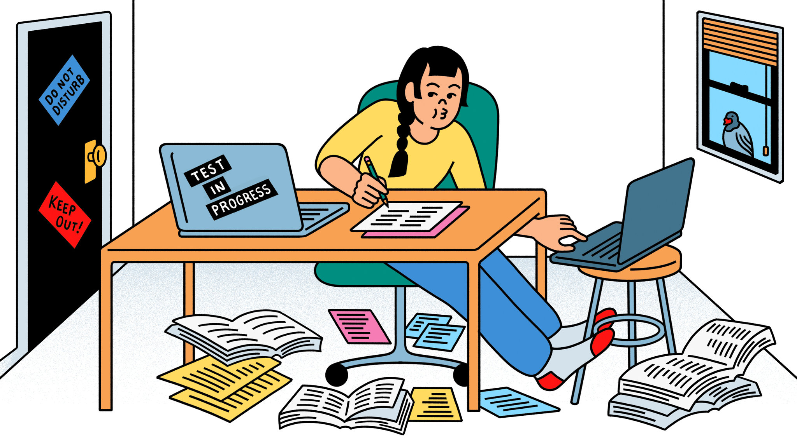

<h1> Categories</h1>

<pre>
<a href="https://coressj.github.io/Project1" target="_top">Home</a> <a href="https://coressj.github.io/Project1/page2" target="_top">Categories</a> <a href="https://coressj.github.io/Project1/page3" target="_top">About us</a> 
</pre>

## How to do good on an exam

## Study

Studying has proven be very effective in college. Many Professors will state that students successful rate would be higher if each student spent 2 to 3 hours outside of class.

Students drink coffee to help them stay awake throughout the day or to help them stay focus while studying. It is said that about 96% of students drink caffeinated beverages regularly.65% consume caffeine every day.

## Coffee

## No Cheating

You are probably saying how can cheating prevent one from passing. Aggie Code of Honor
For many years Aggies have followed a Code of Honor, which is stated in this very simple verse:

An Aggie does not lie, cheat or steal or tolerate those who do.
Getting caught cheating can result in a 0 on a exam. I can probably not study at all and go in blindly and still make a higher grade than a 0. So there you have it, study more, drink plenty of coffee, and stay true to the Aggie's Honor Code.
Gig em!
